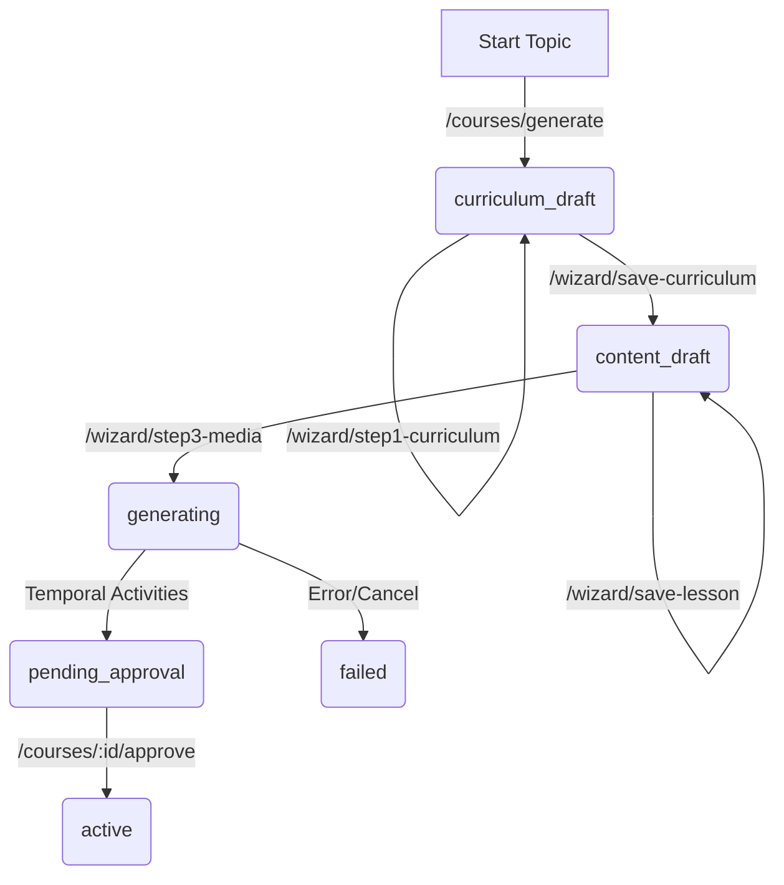

# AI Handover & Developer Documentation: Aethel Learning

Welcome! This documentation is designed to help another AI developer understand the codebase, the system architecture, and how to continue development on this intelligent zero-ops E-Learning platform.

---

## 1. Project Overview

**Aethel Learning** is a modern, responsive web application that generates fully structured, interactive E-Learning courses from simple text prompts. 

Key features include:
1. **Course Designer Wizard (Step-by-Step Creator)**: Admins can generate courses in drafts, review and edit curriculums, slide points, markdown lesson contents, quiz questions, and teleprompter voiceover scripts before triggering media rendering.
2. **Multi-Media Classroom**: Students can read comprehensive theory, complete interactive quizzes, listen to AI voiceovers, and flip through matching slides.
3. **Tamper-Proof Time Tracking**: Students' active learning time is tracked using a secure cryptographic SHA-256 hash-chain to prevent manipulation.

---

## 2. Technical Stack

* **Frontend**: Vanilla HTML5, CSS3, and JavaScript (ES6) served statically from `public/`.
  * `public/index.html`: Contains login screens, admin dashboard (with configurations and course manager), step-by-step wizard, and student classroom interfaces.
  * `public/js/app.js`: Main frontend logic, auth handlers, RAG chat controller, wizard state manager, and classroom slides viewer.
  * `public/css/style.css`: Clean dark glassmorphic design system using the "Outfit" font.
* **Backend API**: Node.js & Express REST API in TypeScript.
  * `src/server/app.ts`: Entry point of the Express server. Handles user management, configuration, wizard drafts, and starts Temporal workflows.
  * `src/server/auth.ts`: Stateless JWT authentication middleware.
  * `src/server/timeTracking.ts`: Handles the cryptographic learning-time verification hash chain.
* **AI Service**: Python FastAPI service in `src/ai_service/main.py`.
  * Integrates with **OpenRouter (Gemini 2.5 Pro)** for structured course curriculum and lesson generation.
  * Uses local/OpenAI embedding models to index lesson text content for RAG queries.
* **Database**: PostgreSQL database managed via **Drizzle ORM**.
  * `src/db/schema.ts`: Defines tables, relations, and pgvector types.
  * `src/db/migrations.ts` & `drizzle/`: Auto-generated migration scripts.
* **Orchestrator**: **Temporal.io** workflow engine.
  * `src/temporal/workflows.ts`: Coordinates sagas and media rendering.
  * `src/temporal/activities.ts`: Synthesizes ElevenLabs audio narrations and links files.

---

## 3. Core Architectures & Workflows

### Course Status Lifecycle
A course moves through the following status enum values (`courses.status` in DB):
1. `curriculum_draft` (Initial step - course outline & slide cards generated by Gemini).
2. `content_draft` (Intermediate step - theory, scripts, and quizzes generated by Gemini).
3. `generating` (Temporal active state - ElevenLabs voiceover is being rendered).
4. `pending_approval` (Media rendered - awaiting Admin approval).
5. `active` (Approved - visible to students).
6. `failed` (Error state).



---

## 4. Key Code Locations

### 📝 Frontend State & Events (`public/js/app.js`)
* **State Object**: `state` manages active sessions, credentials, active classroom lessons, and heartbeats.
* **Wizard State**: `wizardState` stores draft data, `currentStep` (1, 2, 3), and polling intervals.
* **Classroom Slide State**: `classroomSlideState` stores current slide index and bullet array of active lessons.
* **WARNING: Function Declarations**: Do **NOT** reassign function declarations at the bottom of the script (e.g. `selectLesson = function() { ... }`). Reassigning function constants throws a fatal `TypeError` in strict JS environments. Always integrate code extensions (like slide loaders) directly inside the original function declaration.

### 🛡️ Preventing Dialog Dismissals during Polling
* The admin panel polls `loadAdminDashboard` every 5 seconds to show live updates.
* **Crucial Rule**: When showing blocking dialogs (like `confirm()` inside `handleDeleteCourse`), we set `state.isDeleting = true;`. 
* Inside `loadAdminDashboard`, we check this flag. If `true`, the dashboard skips overwriting the table DOM. This prevents the browser from dismissing active confirmation prompts due to element destruction.

### 🛠️ Temporal Workflows (`src/temporal/`)
* **`workflows.ts`**: The `CourseGenerationWorkflow` bypasses curriculum and lesson content generation because those are compiled interactively in Steps 1 and 2 by the Admin. The workflow orchestrates Step 3: Media synthesis.
* **`activities.ts`**: The `startVideoRendering` activity loops through all course lessons, fetches their custom teleprompter scripts, and requests ElevenLabs TTS to output `.mp3` files into `public/audio/audio-${courseId}-${lessonId}.mp3`.

---

## 5. Database Schema

Defined in `src/db/schema.ts`:

1. **`users`**:
   * Stores email, tenantId, and role (`'student' | 'admin' | 'system'`).
2. **`courses`**:
   * Stores title, user, tenantId, status, and progress metadata JSON.
3. **`modules`**:
   * Belongs to a course. Stores modules sequence order and titles.
4. **`lessons`**:
   * Belongs to a module. Stores content payloads:
     ```json
     {
       "description": "Short summary",
       "estimated_duration_minutes": 15,
       "slides": [
         { "title": "Slide Title", "bullets": ["Bullet 1", "Bullet 2"] }
       ],
       "text_content": "# Detailed Markdown Theory...",
       "teleprompter_script": "The text spoken by the AI voice...",
       "quiz": [
         {
           "question": "The question text?",
           "options": ["A", "B", "C", "D"],
           "correct_option_index": 0,
           "explanation": "Why A is correct"
         }
       ]
     }
     ```
5. **`embeddings`**:
   * RAG helper table. Stores `lessonId`, `tenantId`, and `embedding` (`vector(1536)`).
6. **`activity_logs`**:
   * Tracks student study times. Each record contains a SHA-256 hash computed from `userId + sessionId + durationSec + previousHash`, forming an unalterable audit chain.

---

## 6. How to Continue Development

1. **Starting the Services**:
   * **Express REST Server**: `npm run dev:server` (Automatically restarts on edits via `tsx watch`).
   * **Temporal Worker**: `npm run dev:worker` (Automatically restarts on edits via `tsx watch`).
   * **Python AI Service**: Run `python src/ai_service/main.py`. *(Note: This service does not auto-restart, make sure to manually terminate and restart after editing the Python code).*
2. **Drizzle Migrations**:
   * If you modify any columns in `src/db/schema.ts`, run `npx drizzle-kit generate` and restart the Express server (it applies pending migrations on startup). Drizzle enums on text columns do not require PG database schema updates.
