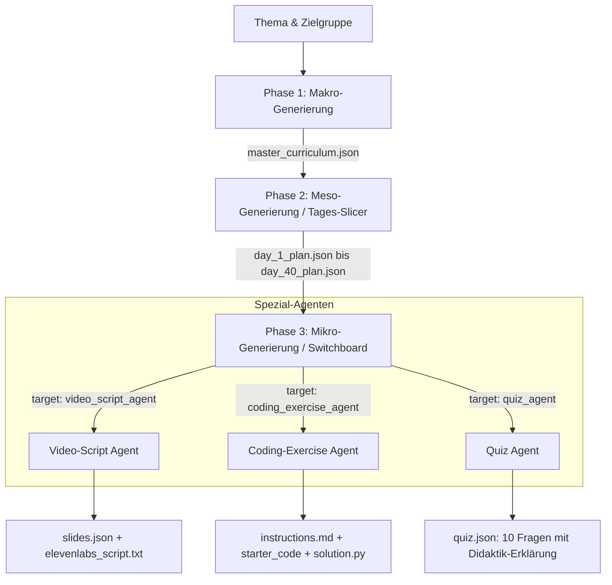

# Didaktisches & Technisches Gesamtkonzept: KI-gestützte Curriculum- & Content-Generierung

> **Dokument:** `doc/konzept.md`  
> **Status:** Konzept- & Architektur-Leitfaden  
> **Basis:** Synthese aus Anforderungsanalysen, Deep-Research-Vorgaben und Multi-Agenten-Spezifikationen (`doc/1 Entwicklung_nicht anschauen/`).

---

## 1. Vision & Leitidee

### 1.1 Das Kernproblem bisheriger KI-Lernangebote
Viele aktuelle Ansätze zur automatisierten Kurserstellung scheitern an didaktischer Oberflächlichkeit:
* **Die „PowerPoint-Hölle“:** Generatoren erzeugen Folien mit langen Textwüsten und Bullet-Points.
* **Monotones Ablesen:** Text-to-Speech-Engines lesen die Folientexte 1:1 vor. Es entsteht keine Zuhör-Motivation.
* **Fehlende Praxis-Schleifen:** Die Lernenden konsumieren passiv Videos, ohne geführte Hands-on-Übungen oder nachvollziehbare Lernerfolgskontrollen.
* **Kontextverlust bei Großkursen:** Versucht ein einzelnes Sprachmodell (Prompt) einen kompletten mehrwöchigen Kurs zu erstellen, bricht die Generierung durch Token-Limits, Wiederholungen und Halluzinationen zusammen.

### 1.2 Die Leitidee der Course Factory
Die Plattform realisiert eine **vollautomatisierte, qualitätsgesicherte Bildungsmaßnahme nach AZAV/AVGS-Standard** (bis zu 8 Wochen / 40 Tage / 320 Unterrichtseinheiten à 45 Minuten) mit maximalem Automatisierungsgrad (**Zero-Ops** für den Dozenten):
1. **Hierarchischer Top-Down-Ansatz:** Zerlegung eines Themas in Makro- (Wochen), Meso- (Tage) und Mikro-Ebenen (45-Minuten-UEs).
2. **Didaktischer Methodenwechsel:** Jeder Tag garantiert ein ausgewogenes Verhältnis aus Konzept-Theorie, intensiver Programmierpraxis und strukturiertem Assessment.
3. **Differenzierung zwischen Auge und Ohr:** Folien enthalten visuelle Reize (max. 5–7 Worte, Mermaid-Diagramme, Code-Syntax), während das Audioskript (ElevenLabs) frei, didaktisch vertiefend und lebendig formuliert ist.
4. **Code-First Microservice-Architektur:** Keine instabilen No-Code-Tools (wie Make oder n8n), sondern deterministische Pipelines mit Checkpoints, Selbstreparatur und strikten JSON-Schemata.

---

## 2. Didaktisches Rahmenwerk (AZAV/AVGS Standard)

### 2.1 Zeitraster & Unterrichtseinheiten (UE)
Eine zertifizierte Vollzeit-Maßnahme umfasst 8 Unterrichtseinheiten à 45 Minuten pro Tag (entspricht 6 Zeitstunden Netto-Lernzeit).

```
┌─────────────────────────────────────────────────────────────────────────────┐
│                       EIN ARBEITSTAG (8 UE = 360 MINUTEN)                   │
├───────────────────────┬─────────────────────────────┬───────────────────────┤
│  VORMITTAG (4 UE)     │     NACHMITTAG (3 UE)       │    TAGESABSCHLUSS     │
│  Theorie & Fundament  │     Praxis & Hands-On       │    Review & Prüfung   │
│  UE 1 - UE 4          │     UE 5 - UE 7             │    UE 8               │
│  (Video-Script-Agent) │     (Coding-Exercise-Agent) │    (Quiz-Agent)       │
└───────────────────────┴─────────────────────────────┴───────────────────────┘
```

### 2.2 Der tägliche didaktische Spannungsbogen
Jeder Tag folgt einem festen didaktischen Dreiklang:
* **Theorie-Phase (3–4 UE):** Vermittlung mentaler Modelle, Systemarchitekturen und Best Practices. Aufbereitung über kurze, fokussierte Videolektionen (10–15 Minuten Vortragszeit pro 45-Minuten-Einheit) mit Begleitmaterial.
* **Praxis-Phase (3–4 UE):** Reale Problemlösungen am Code. Die Teilnehmenden erhalten vorbereitete Projektgerüste (Boilerplate) mit klaren Aufgabenstellungen und `# TODO:`-Lücken, die sie eigenständig lösen.
* **Assessment-Phase (1–2 UE):** Systematische Wissensüberprüfung über 10 Multiple-Choice-Fragen mit detaillierten didaktischen Erklärungen (`explanation`) zu typischen Fallstricken und Distraktoren.

---

## 3. Das Multi-Agenten-Paradigma (Hierarchische Pipeline)

Um die Komplexität von 320 Einheiten fehlerfrei zu bewältigen, operiert das System in drei aufeinander aufbauenden Phasen:



### 3.1 Phase 1: Makro-Generierung (`macro_generator.py`)
* **Input:** Kurstitel, Zielgruppe, Wochenanzahl (1 bis 8 Wochen).
* **Funktion:** Definiert für jede Woche ein Leitthema und für jeden Tag ein klares Tagesziel (`day_theme`), den didaktischen Ansatz (`didactic_approach`) sowie den angestrebten Meilenstein (`daily_milestone`).
* **Output:** `master_curriculum.json` (Grobkonzept für 40 Tage).

### 3.2 Phase 2: Meso-Generierung (`meso_generator.py`)
* **Input:** Einzelner Tag aus dem Makro-Curriculum.
* **Funktion:** Teilt den Tag in exakt 8 Einheiten auf. Bestimmt die Einheiten-Typen (`theory`, `practice`, `assessment`) und routet jede Einheit an den zuständigen Spezialagenten (`target_agent`).
* **Output:** `day_{n}_plan.json`.

### 3.3 Phase 3: Mikro-Generierung (Spezial-Agenten)

#### A. Video-Script-Agent (`video_script_agent.py`)
* **Folien-Regel:** Radikale Reduktion. Maximal 5 bis 7 Worte Text pro Folie. Keine Aufzählungsorgien.
* **Layout-Typen:** `Title_Slide`, `Diagram` (Mermaid.js Flowcharts/Sequenzen), `Code_Snippet` (mit Syntax-Highlighting) und `Icon_Grid`.
* **Sprechertext-Regel:** Geschrieben für das Ohr. Lebendige Sprache, Nutzung von Sprechpausen (`...`), rhetorischen Fragen und direkter Hörer-Ansprache („Du“).

#### B. Coding-Exercise-Agent (`coding_exercise_agent.py`)
* **Praxis-Regel:** Kein triviales „Hello World“, sondern anwendungsbezogene Aufgaben (z. B. Authentifizierung, API-Handling, Error-Boundary, RAG-Pipeline).
* **Artefakte:**
  * `instructions.md`: Aufgabenstellung, Anforderungen, Praxistipps (ohne Spoiler).
  * `boilerplate_code`: Starter-Code mit `# TODO:`-Kommentaren.
  * `solution_code`: Vollständige, getestete Musterlösung.
  * `validation_criteria`: Liste objektiver Prüfkriterien für automatische Validierung.

#### C. Quiz-Agent (`quiz_agent.py`)
* **Assessment-Regel:** Exakt 10 Multiple-Choice-Fragen pro Einheit mit 4 Optionen (A, B, C, D).
* **Didaktische Tiefe:** Plausible Distraktoren, die echte Programmierfehler abbilden, ergänzt um ein Feld `explanation`, das transparent begründet, warum die richtige Option greift.

---

## 4. Innovative Ideen zur Weiterentwicklung

### Idee 1: Adaptive Lernpfade & Dynamische Skill-Gap-Curricula
* **Konzept:** Vor Kursbeginn absolviert der Teilnehmende eine 15-minütige KI-Skill-Analyse.
* **Umsetzung:** Ein `Diagnostic-Agent` wertet Stärken und Schwächen aus und passt das 320-UE-Mastercurriculum dynamisch an. Fortgeschrittene Teilnehmende erhalten vertiefende Coding-Labs, während Grundlagen bei Bedarf intensiviert werden.

### Idee 2: Automatisierter AI-Code-Reviewer & Feedback-Agent
* **Konzept:** Der Schüler lädt seinen gelösten Code im Portal hoch oder committet in ein Git-Repository.
* **Umsetzung:** Ein serverseitiger Agent führt automatische Tests gegen die `validation_criteria` durch, vergleicht den Code mit der `solution.py` und erzeugt binnen Sekunden ein konstruktives Zeilen-Feedback mit Hinweisen zu Code-Smells, Sicherheit und Lesbarkeit.

### Idee 3: Vollautomatisiertes Video-Stitching per Headless-Canvas & FFmpeg
* **Konzept:** Vollständige Beseitigung manueller Videoschnitt-Schritte.
* **Umsetzung:**
  1. Die Folien-JSONs werden über HTML5/Canvas oder Remotion serverseitig als 1080p-Bilder gerendert.
  2. Mermaid-Diagramme werden programmatisch in Vektorgrafiken gerendert.
  3. Die ElevenLabs-Audiospur liefert präzise Zeitstempel pro Absatz.
  4. Ein Node/Python-Worker fügt Audio, Slides und sanfte Überblendungen per FFmpeg zu einem fertigen MP4-Lehrvideo zusammen.

### Idee 4: Fotorealistische Avatar-Dozenten (HeyGen / Synthesia Webhooks)
* **Konzept:** Für Intro- und Outro-Sequenzen eines Tages wird ein digitaler Dozenten-Avatar generiert.
* **Umsetzung:** Der `video_script_agent` markiert Begrüßung und Tageszusammenfassung als `avatar_presentation`. Ein asynchroner Webhook-Job generiert das Avatar-Video und integriert es nahtlos in die Lektion.

### Idee 5: Multi-LLM Ensemble & Quality-Gate-Agent
* **Konzept:** Vier-Augen-Prinzip zwischen zwei verschiedenen KI-Architekturen.
* **Umsetzung:** Ein kostengünstiges Modell (z. B. GLM-5.3 oder DeepSeek) generiert die Entwürfe. Ein nachgeschalteter `Quality-Gate-Agent` (z. B. Claude 3.5 Sonnet oder Gemini 2.5 Pro) prüft die Entwürfe auf:
  * Syntax-Fehler in den Python-Lösungen
  * Ungültige Mermaid-Diagramm-Syntax
  * Korrektheit der Quiz-Schlüssel
  * Einhaltung der 8-UE-Quote pro Tag

### Idee 6: Didaktisches Drip-Content & Gamification
* **Konzept:** Verhindert das unüberlegte Überspringen von Inhalten und motiviert durch Meilensteine.
* **Umsetzung:** Ein Kurstag schaltet sich erst frei, wenn:
  1. Die 8 UEs des Vortages zeitlich nachweisbar absolviert wurden (Verknüpfung mit dem SHA-256 Time-Tracker).
  2. Das tägliche 10-Fragen-Quiz mit mindestens 70 % bestanden wurde.
  3. Am Ende einer jeden Woche wird ein automatischer "Meilenstein-Report" für die Förderstelle erzeugt.

---

## 5. Datenmodelle & Verzeichnisstruktur

### 5.1 Kanonische Dateisystem-Struktur der Course Factory

```
course_output/
├── progress.json                     <-- Checkpoint-Status (completed_ues, percent, active_day)
├── master_curriculum.json            <-- Level 1 Makro-Plan (40 Tage)
├── week_1/
│   ├── day_1/
│   │   ├── day_plan.json             <-- Level 2 Meso-Plan (8 UEs)
│   │   ├── ue_1_theory/
│   │   │   ├── slides.json           <-- Folien-Definition & Layouts
│   │   │   ├── elevenlabs_script.txt <-- Gesprochener Text
│   │   │   └── audio.mp3             <-- Optional: Synthetisierte Audiospur
│   │   ├── ue_2_theory/
│   │   │   └── ...
│   │   ├── ue_5_practice/
│   │   │   ├── instructions.md       <-- Aufgabenstellung für Schüler
│   │   │   ├── starter_code.py       <-- Boilerplate mit # TODO
│   │   │   ├── solution.py           <-- Vollständige Musterlösung
│   │   │   └── validation.json       <-- Prüfkriterien
│   │   └── ue_8_assessment/
│   │       └── quiz.json             <-- 10 Fragen mit Antworten & Erklärungen
│   ├── day_2/
│   │   └── ...
└── week_2/ ... week_8/
```

### 5.2 JSON-Schema: Master-Curriculum (Auszug)
```json
{
  "course_title": "KI-gestützte Softwareentwicklung und Agenten-Workflows",
  "target_audience": "Softwareentwickler mit Backend-Erfahrung",
  "total_weeks": 8,
  "weeks": [
    {
      "week_number": 1,
      "week_theme": "Grundlagen generativer KI, Prompt Engineering & LLM-APIs",
      "days": [
        {
          "day_number": 1,
          "day_theme": "Einführung in Transformer, Tokenomics und API-Anbindung",
          "didactic_approach": "Theorieblöcke am Vormittag, geführte Python-Praxis am Nachmittag",
          "units_breakdown": {
            "theory_ue": 4,
            "practice_ue": 3,
            "assessment_ue": 1
          },
          "daily_milestone": "Lauffähiges Skript für strukturierte JSON-Extraktion über LLM-APIs"
        }
      ]
    }
  ]
}
```

### 5.3 JSON-Schema: Day-Plan & Unit-Routing (Auszug)
```json
{
  "day_number": 1,
  "day_theme": "Einführung in Transformer, Tokenomics und API-Anbindung",
  "units": [
    {
      "ue_number": 1,
      "ue_title": "Architektur von Large Language Models",
      "ue_type": "theory",
      "target_agent": "video_script_agent",
      "learning_objective": "Die Teilnehmenden verstehen Tokenisierung, Attention-Mechanismen und Context Windows.",
      "content_outline": [
        "Wie funktioniert der Attention-Mechanismus?",
        "Tokenomics: Warum Token keine Wörter sind",
        "Einfluss des Context Windows auf die Latenz"
      ]
    },
    {
      "ue_number": 5,
      "ue_title": "Hands-On: API-Integration mit Fehlerbehandlung",
      "ue_type": "practice",
      "target_agent": "coding_exercise_agent",
      "learning_objective": "Selbstständige Implementierung eines API-Clients mit Exponential Backoff.",
      "content_outline": [
        "Aufbau von REST-Requests an LLM-Provider",
        "Fehlerbehandlung bei HTTP 429 und Timeouts",
        "Sauberes Parsen von JSON-Payloads"
      ]
    },
    {
      "ue_number": 8,
      "ue_title": "Wissens-Check: Tag 1 Grundlagen",
      "ue_type": "assessment",
      "target_agent": "quiz_agent",
      "learning_objective": "Überprüfung des theoretischen und praktischen Verständnisses.",
      "content_outline": [
        "10 Multiple-Choice Fragen zu Token, APIs und Kontextfenstern"
      ]
    }
  ]
}
```

---

## 6. Technische Umsetzungsstrategie (Zero-Ops & Stabilität)

### 6.1 Selbstreparatur bei JSON-Fehlern (Self-Healing Parser)
LLMs können bei umfangreichen Ausgaben JSON-Syntaxfehler erzeugen (z. B. vergessene Klammern oder nicht escapte Anführungszeichen).
* **Maßnahme:** Der Python-Orchestrator implementiert einen mehrstufigen Parser:
  1. Standard `json.loads()`
  2. Bereinigung über Regex-Blockextraktion (Entfernung von Markdown-Ummantelungen)
  3. `Pydantic`-Validierung gegen das strikte Zielschema
  4. Bei Validierungsfehler: Automatischer Retry-Call an das Modell mit dem genauen Fehlerstacktrace zur Selbstkorrektur.

### 6.2 Robuste Checkpointing-Architektur
* Vor jedem Agentenaufruf prüft der Orchestrator, ob das Zielartefakt (z. B. `day_1/ue_3_theory/slides.json`) bereits vollständig auf der Festplatte existiert.
* **Ergebnis:** Beliebige Unterbrechungen (Stromausfall, Netzwerkabbruch, Rate Limits) führen zu keinem doppelten API-Verbrauch. Die Generierung setzt auf Knopfdruck an der exakten Bruchstelle fort.

---

## 7. Zusammenfassung & Nächste Ausbaustufen

| Ausbaustufe | Fokus | Status |
| :--- | :--- | :--- |
| **Phase 1** | Top-Down Makro- & Meso-Planung (1 Tag bis 8 Wochen / 320 UE) | ✅ **Produktiv** |
| **Phase 2** | Spezial-Agenten (Video-Script, Coding-Lab, 10-Fragen-Quiz) | ✅ **Produktiv** |
| **Phase 3** | Inspector-UI, Checkpointing, Pause/Resume & Prompt-Editor | ✅ **Produktiv** |
| **Phase 4** | Headless-Videorendering via FFmpeg & Canvas-Slides | 🚀 *In Vorbereitung* |
| **Phase 5** | Automatisierter AI-Code-Reviewer für Schülerabgaben | 🚀 *In Vorbereitung* |

---
*Dokumentiert für das Projekt KI E-Learning Platform. Alle Rechte vorbehalten.*
